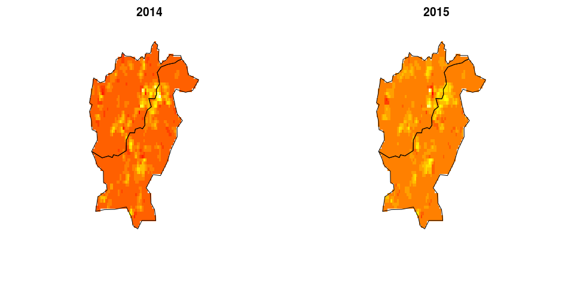

This supplementary material illustrate the fitting of the models
discussed in *Detecting Subnational Diffusion Processes of Lethal
Terrorism: Global Study, 2010-2016* using a subset of the data discussed
in that article. There is an online version of this tutorial available
[here](https://github.com/cmjt/examples/blob/master/diffusion.md).

Fitting code available either in the package available
[here](https://github.com/cmjt/lgcpSPDE) or functions are provided in
the supplementary
[functions.r](https://github.com/cmjt/examples/blob/master/materials/functions.r)
file (as per [Python, A., et al,
2018](https://rss.onlinelibrary.wiley.com/doi/abs/10.1111/rssa.12384)).

Hotspot evaluation code was written by [A.
Python](andre.python@bdi.ox.ac.uk).

    ## load required packages
    require(INLA)  ## model fitting
    require(spatstat)  ## functions for spatial data
    require(sp)
    require(GISTools)
    require(raster)
    require(rgeos)
    require(maptools)

    ## example data supplied with this material
    load("pnas_example.RData")
    ## fiting functions supplied with this material
    source("functions.r")

Model fitting example
---------------------

    head(example.df)  ## data for Afghanistan and Pakistan

    ##           x         y         z country country.idx latitude longitude
    ## 1 0.3463239 0.8395703 0.4185469     PAK           2     24.5      67.5
    ## 2 0.3364243 0.8437153 0.4182859     PAK           2     24.5      68.5
    ## 3 0.3136284 0.8523466 0.4185002     PAK           2     24.5      70.0
    ## 4 0.4237748 0.7994831 0.4257250     PAK           2     25.0      62.0
    ## 5 0.4202658 0.8015146 0.4253835     PAK           2     25.0      62.5
    ## 6 0.3544914 0.8352477 0.4203536     PAK           2     25.0      67.0
    ##   year year.idx population  time.to.city luminosity total
    ## 1 2014        1 -0.3558181  0.0005527337 -0.2549383     1
    ## 2 2015        2 -0.3304876 -0.0636544096 -0.9392858     1
    ## 3 2015        2 -0.3613648  0.5665875776 -0.2874247     1
    ## 4 2014        1 -0.3671028  1.5319930208 -1.3627242     1
    ## 5 2015        2 -0.3664247  1.1245760187 -0.7493187     3
    ## 6 2014        1  3.8020456 -0.4888692221  1.1150337   277

    plot(sp)  ## plot Afghanistan and Pakistan boundry
    points(example.df$longitude, example.df$latitude, pch = 20)  ## centroid points

    ## make mesh; this is an example the mesh only
    bdry <- inla.sp2segment(sp)
    bdry$loc <- inla.mesh.map(bdry$loc, projection = "longlat", inverse = TRUE)  ## 
    mesh <- inla.mesh.2d(boundary = bdry, max.edge = c(4, 7)/900, 
        cutoff = 4/900)
    ## set up model info
    locs <- as.matrix(example.df[, 1:3])
    response <- example.df$total
    covariates <- data.frame(population = example.df$population, 
        time.to.city = example.df$time.to.city, luminosity = example.df$luminosity)
    t.idx <- example.df$year.idx
    country.idx <- example.df$country.idx
    ## call fitting function
    fit <- geo.fit(mesh = mesh, locs = locs, response = response, 
        covariates = covariates, control.time = list(model = "rw1", 
            param = list(theta = list(prior = "pc.prec", param = c(1, 
                0.01)))), temp = t.idx, verbose = TRUE, family = "poisson", 
        non.linear = list(random.effect = country.idx, model = "iid"))

Finding "Hotspots"
------------------

    k <- 2  #number of years
    resol <- c(1440, 720)
    fields <- find.fields(fit, mesh, n.t = k, spatial.polygon = sp, 
        dims = resol)
    sdfields <- find.fields(fit, sd = TRUE, mesh, n.t = k, spatial.polygon = sp, 
        dims = resol)
    proj = inla.mesh.projector(mesh, projection = "longlat", dims = resol)

### Plotting the random fields

    ## Random fields
    par(mfrow = c(1, 2), mar = c(1, 2, 2, 1))  ## plot random effects on link scale
    image(proj$x, proj$y, fields[[1]][[1]], ylim = c(20, 40), xlim = c(50, 
        90), xlab = "", ylab = "", axes = FALSE, main = "2014")
    plot(sp, add = TRUE)
    image(proj$x, proj$y, fields[[1]][[2]], ylim = c(20, 40), xlim = c(50, 
        90), xlab = "", ylab = "", axes = FALSE, main = "2015")
    plot(sp, add = TRUE)

